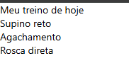

# Step-01 - Meu treino de hoje

Aplicativo desenvolvido em React Native utilizando Expo.

## Funcionalidades

- Exibição do título "Meu treino de hoje"
- Exibição dos exercícios:
  - Supino reto
  - Agachamento
  - Rosca direta

## Tecnologias utilizadas

- React Native
- Expo
- JavaScript

## Resultado

A tela apresenta o treino do dia de forma simples, utilizando os componentes `View` e `Text`.
